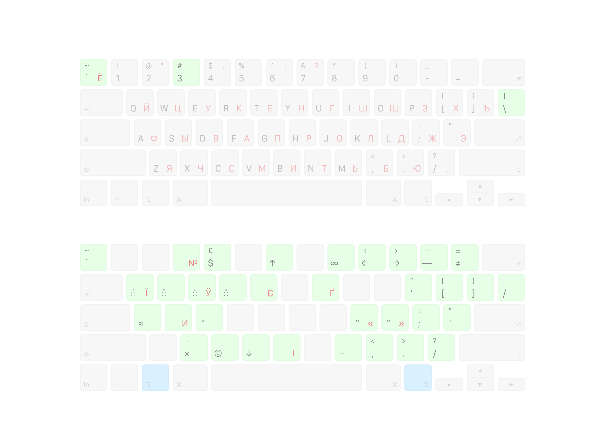
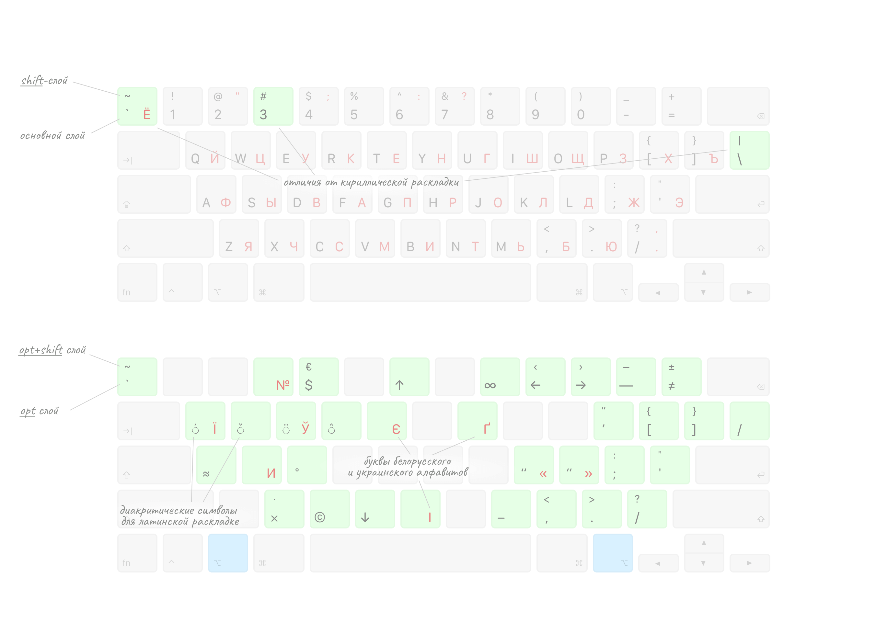

# Универсальная раскладка клавиатуры для US-клавиатур

Универсальная раскладка — пакет из английской и русско-белорусской-украинской раскладок для Мака, спроектированных для удобного совместного использования.

> US-клавиатура — это клавиатура, где горизонтально вытянутая клавиша Enter. INTL-клавиатура — это где клавиша Enter занимает два ряда.
>
> Как раскладка будет работать на Intl-клавиатуре — я пока не знаю.

## Проблемы

У меня накопилось много претензий к стандартной и нестандартной раскладкам:
- в русской раскладке не достучаться до `#`;
- в русской раскладке сложно набирать `<>[]{}`;
- каждый раз надо вспоминать, где в какой раскладке лежат `|\/`;
- тяжело переключаться между русской, белорусской и украинской раскладкой. На украинской сломано всё, что можно сломать;
- прыгающие по кнопкам знаки препинания;
- в раскладке Бирмана на US-клавиатуре тильда под ESC заменяется на терминатор и это ужасно.

## Решение

Можно выучить alt-коды всех нужных символов. Можно выучить option-слой в маковской раскладке (а он огромный, посмотрите). Можно всё, но...

**Можно сделать самому и ХУЖЕ**

Вдохновившись [типографской раскладкой Бирмана](https://ilyabirman.ru/typography-layout/) и [универсальной раскладкой Тонского](https://github.com/tonsky/Universal-Layout), я решил сварганить своё поделие.



При этом я старался придерживаться следующих правил:

### Правила

1. Основные слои (базовый и `shift`) остаются максимально as is
2. Все модификации вынесены на слои `opt` и `opt+shift` и работают на обеих раскладках.

### Изменения в основном слое

1. Бэктик `` ` `` вызывается через `` opt+` `` в обеих раскладках
2. Тильда `` ~ `` вызывается через `` opt+shift+` `` в обеих раскладках
3. Слэши `\|`теперь стандартны в обеих раскладках
4. `#` теперь в обеих раскладках вызывается через `shift+3`

### Дополнительные слои `opt` и `opt+shift`
Смотрите картинку ниже, там показаны все дополнительные символы, доступные в раскладке

- Типографские кавычки первого уровня для англ и русской раскладке на `K` и `L`
- Знак доллара и евро на `3`
- Все скобки и слэши дублируют поведение английской раскладки

### Кириллическая раскладка

1. `№` — через `opt+3`
2. Беларускія буквы `[іў]` через `opt+(shift)+[иу]` — удобно для мнемонического запоминания
3. Апостроф `'` ставится через `opt+э`, где он и находится в английской раскладке
4. Украинские буквы `[іїиєґ]` через `opt+(shift)+[ийыег]` — тоже удобно



## Проблемы

Куда без проблем. При переназначении клавиши `` ` `` отвалилось переключение между окнами одного приложения (`` win+` ``)

Для решения на биндинг переключения раскладок в karabiner были повешены два дополнительных скрипта:

```clojure
;; Templates
:templates {
  :eng-tilda-mapping "hidutil property --set '{\"UserKeyMapping\": []}'"
  :cyr-tilda-mapping "hidutil property --set '{\"UserKeyMapping\": [{\"HIDKeyboardModifierMappingSrc\": 0x700000064, \"HIDKeyboardModifierMappingDst\": 0x700000035}, {\"HIDKeyboardModifierMappingSrc\": 0x700000035, \"HIDKeyboardModifierMappingDst\": 0x700000064}]}'"
}

 ;; Input Sources
 :input-sources {
  :eng-seigiard {:input_source_id "^org.sil.ukelele.keyboardlayout.seigiardlayout.english-seigiardtypography$"}
  :cyr-seigiard {:input_source_id "^org.sil.ukelele.keyboardlayout.seigiardlayout.cyrillic-seigiardtypography$"}
}

 ;; BINDINGS
 :main [
  {
    :des "Left Cmd → Seigiard Eng, Right Cmd → Seigiard Cyr"
    :rules [
      [:condi :!rdp :!parallels]
      [:left_command      :left_command  nil  {:alone [{:input :eng-seigiard} [:eng-tilda-mapping]]}]
      [:right_command     :right_command nil {:alone [{:input :cyr-seigiard} [:cyr-tilda-mapping]]}]
    ]
  }
]
```

## Установка

- Скачать `.dmg`-файл
- Открыть `.dmg`-файл
- Перенести файл раскладки в папку `~/Library/Keyboard Layouts`
- Возможно, придётся перезагрузить компьютер

Можно попробовать и через инсталятор, сгенерированный Ukelele (лежит в архиве), но его работу я не могу гарантировать.

# Universal Keyboard Layout

Another approach to solve common problem.

Inspired by [Tonsky's Universal Layout](https://github.com/tonsky/Universal-Layout) and [Ilya Birman′s typographic layout](https://ilyabirman.ru/typography-layout/).